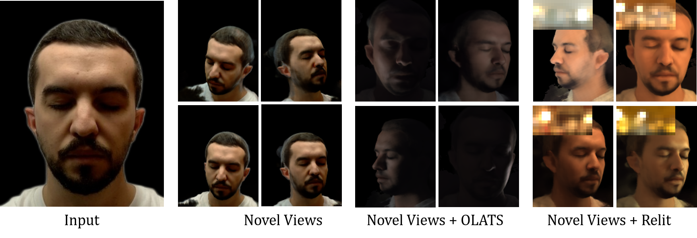

<p align="center">

  <h1 align="center">VoRF: Volumetric Relightable Faces
    <a href='https://people.mpi-inf.mpg.de/~prao/papers/vorf_journal/vorf_ijcv.pdf'>
    
    </a>
    <a href='https://vcai.mpi-inf.mpg.de/projects/VoRF/' style='padding-left: 0.5rem;'>
    
  </h1>
  <p align="center">
    <a href="https://people.mpi-inf.mpg.de/~prao/"><strong>Pramod Rao</strong></a>
    ·
    <a href="https://people.mpi-inf.mpg.de/~mbr/"><strong>Mallikarjun B R</strong></a>
    ·
    <a href="https://people.mpi-inf.mpg.de/~gfox/"><strong>Gereon Fox</strong></a>
    .
    <a href="https://fnzhan.com/"><strong>Fangneng Zhan</strong></a>
    .
    <a href="https://reality.cs.ucl.ac.uk/weyrich.html"><strong>Tim Weyrich</strong></a>
    ·
    <a href="http://berndbickel.com/about-me"><strong>Bernd Bickle</strong></a>
    .
    <a href="https://vcg.seas.harvard.edu/people/hanspeter-pfister"><strong>Hanspeter Fister</strong></a>
    ·
    <a href="https://cdfg.csail.mit.edu/wojciech"><strong>Wojciech Matusik</strong></a>
    .
    <a href="https://ayushtewari.com/"><strong>Ayush Tewari</strong></a>
    .
    <a href="http://www.mpi-inf.mpg.de/~theobalt/"><strong>Christian Theobalt</strong></a>
    ·
    <a href="http://people.mpi-inf.mpg.de/~elgharib/"><strong>Mohamed Elgharib</strong></a>
  </p>
  <h2 align="center">BMVC (Best Paper Honorable Mention) 2022 and IJCV 2023</h2>
  <div align="center">
  </div>
</p>
<p float="center">
  
</p>


## Citation
If you find our code or paper useful, please cite as:
```
@article{prao2022vorf,
title = {VoRF: Volumetric Relightable Faces},
author = {Rao, Pramod and {B R}, Mallikarjun and Fox, Gereon and Weyrich, Tim and Bickel, Bernd and Seidel, Hans-Peter and Pfister, Hanspeter and Matusik, Wojciech and Tewari, Ayush and Theobalt, Christian and  Elgharib, Mohamed },
booktitle = {British Machine Vision Conference (BMVC)},
year={2022}
}

@article{prao2023vorf,
  title = {A Deeper Analysis of Volumetric Relightiable Faces},
  author = {Rao, Pramod and B R, Mallikarjun and Fox, Gereon and Weyrich, Tim and Bickel, Bernd and Pfister, Hanspeter and Matusik, Wojciech and Zhan, Fangneng and Tewari, Ayush and Theobalt, Christian and Elgharib, Mohamed},
  journal = {International Journal of Computer Vision (IJCV)},
  publisher = Springer,
  year = 2023,
  month = oct,
  day = 31,
  doi = {10.1007/s11263-023-01899-3},
}

```

## Getting Started

## Testing

## Relighting
